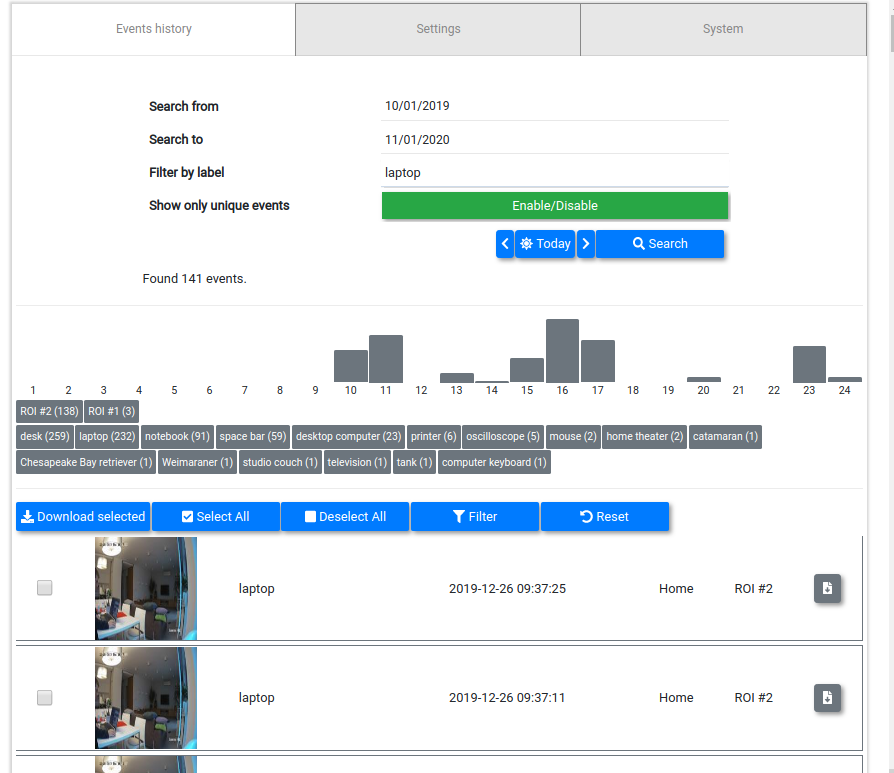

# clever-camera

Simple security camera which uses deep learning model to predict the 
content of the image and trigger snapshot for specified labels. 

# Features

## History view

 * Search by date and by label
 * Filter by hour of event
 * Filter by label name
 * Download selected as zip
 * Download single image

## Camera definition view

 * Add or Remove Region of interest (ROI)
 * Select between different MobileNets


 * Define camera client: User with Password
 * Define monitoring week-days and from-to hours
 * Define how often pictures are taken
 * Define email notifications 
 
## Resources view

 * Monitor system RAM and disk usage

# Installation
## Installation and running camera server on Ubuntu/Linux
```
create env conda/virtualenv...
source your_environment
pip install https://dl.google.com/coral/python/tflite_runtime-1.14.0-cp36-cp36m-linux_x86_64.whl
pip install -r requirements.txt

# Run 
python app/app.py
# Run with login required (more safe)
bash run.sh
```

## Installation and running camera server on Raspberry Pi 

In the project location run following commands:

```bash
python3 -m pip install --user virtualenv
virtualenv venv
source venv/bin/activate
pip3.7 install https://dl.google.com/coral/python/tflite_runtime-1.14.0-cp37-cp37m-linux_armv7l.whl
pip3.7 install -r requirements.txt
python3.7 app/app.py
```

# Limitations and project assumptions:

* This application was build to work with single user.
* Only single camera is supported, however adding more should be very easy in practice.   
* Classification is based on MobileNets models family in the tflite format. Using pytorch 
    or other frameworks is possible. One must implement custom `core.base_predictor.ClassifierPredictor` 
    and replace it in the `core.camera_widget.CameraWidget` class.
* Pure python: web server is based on [remigui](https://github.com/dddomodossola/remi) library.


